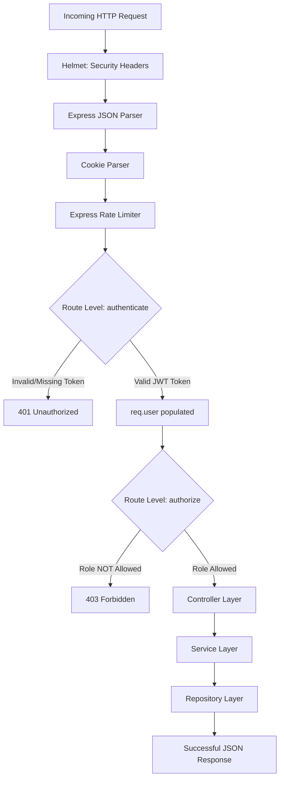

# 🔐 Express & TypeScript Role-Based Access Control (RBAC) Middleware

A robust, type-safe implementation of **Role-Based Access Control (RBAC)** built with **Express.js (v5)** and **TypeScript**. This project demonstrates a clean, layered architecture (Controllers ➔ Services ➔ Repositories) combined with secure middleware pipelines to protect API resources based on user roles and permissions.

---

## 🚀 Key Features

*   **Type-Safe Request Augmentation** — Extends Express's default `Request` object using TypeScript declaration merging to provide type-safe access to `req.user`.
*   **Layered Clean Architecture** — Separation of concerns through a classic Controller-Service-Repository pattern.
*   **Role-Based Access Control (RBAC)** — Fine-grained authorization middleware checking roles hierarchically (`ADMIN`, `EDITOR`, `CONTRIBUTOR`).
*   **Security Hardening** — Secure HTTP headers configuration via `helmet` and API rate limiting via `express-rate-limit`.
*   **Path Aliases** — Simplified module resolution using the `@/` path alias mapped to `src/`.
*   **Automated Token Generator** — Custom utility script to instantly create test JWTs for different roles.

---

## 🏗️ Architecture & Request Flow

The application processes requests through a security-hardened middleware pipeline before invoking the business logic layers.

### Middleware Execution Pipeline



### Layered Architecture Structure

*   **Controller Layer** (`src/controllers`): Validates incoming payload schema, interacts with Services, and returns HTTP responses.
*   **Service Layer** (`src/services`): Houses the business logic. It orchestrates operations and remains decoupled from HTTP frameworks.
*   **Repository Layer** (`src/repositories`): Abstracts data source interactions (database/mock memory querying).

---

## 📁 Project Structure

```text
.
├── .env                          # Environment configurations (JWT secrets, Port)
├── tsconfig.json                 # TypeScript compiler configuration & path aliases
├── package.json                  # Dependencies, devDependencies, and run scripts
├── src/
│   ├── app.ts                    # Express app initialization & global middlewares
│   ├── server.ts                 # Server entry point
│   ├── config/
│   │   └── rateLimit.ts          # Rate limiting configuration (express-rate-limit)
│   ├── controllers/
│   │   └── user.controller.ts    # Route request handlers
│   ├── middlewares/
│   │   ├── auth.middleware.ts    # JWT token verification (Bearer scheme)
│   │   └── authorize.middleware.ts # Role permission verification
│   ├── repositories/
│   │   └── user.repository.ts    # Mock data-access layer
│   ├── routes/
│   │   └── user.routes.ts        # Route declarations and middleware binding
│   ├── services/
│   │   └── user.service.ts       # Business logic orchestrator
│   ├── types/
│   │   ├── express.d.ts          # Express Request namespace augmentation
│   │   └── role.ts               # Role Enum definitions (ADMIN, EDITOR, CONTRIBUTOR)
│   └── utils/
│       └── jwt.ts                # Token sign & verify helper functions
└── scripts/
    └── generateTokens.ts         # Diagnostic script for generating test JWTs
```

---

## 🔑 Role & Route Permissions Matrix

| Endpoint | Method | Required Headers | Allowed Roles | Description |
| :--- | :---: | :--- | :--- | :--- |
| `/api/profile` | `GET` | `Authorization: Bearer <token>` | `ADMIN`, `EDITOR`, `CONTRIBUTOR` | Retrieves the profile of the authenticated user. |
| `/api/content` | `POST` | `Authorization: Bearer <token>` | `ADMIN`, `EDITOR` | Simulates creating a new content entry. |
| `/api/system` | `DELETE` | `Authorization: Bearer <token>` | `ADMIN` | Simulates executing administrative system operations. |

---

## 🛠️ TypeScript & Request Augmentation

To ensure type-safety when accessing the authenticated user's details on `req.user`, the Express `Request` interface is augmented under `src/types/express.d.ts`:

```typescript
import { Role } from "./role";

declare global {
    namespace Express {
        interface Request {
            user: {
                id: string;
                role: Role;
            };
        }
    }
}

export {};
```

This ensures TypeScript compilation passes when accessing `req.user.id` or `req.user.role` anywhere in the controllers or middlewares.

---

## ⚙️ Getting Started

### Prerequisites

*   **Node.js** >= 18.x
*   **npm** >= 9.x

### Installation

1.  Clone the repository:
    ```bash
    git clone https://github.com/Shyam-Shaji/RBAC-Middleware.git
    cd RBAC-Middleware
    ```

2.  Install dependencies:
    ```bash
    npm install
    ```

3.  Configure Environment Variables:
    Create a `.env` file in the root directory:
    ```env
    PORT=5000
    JWT_SECRET=e1db019ad605dba3
    ```

---

## 🏃 Running the Application

### Development Mode

Runs the server locally using `nodemon` and `ts-node` for automatic code reload:

```bash
npm run dev
```

The server will be running on `http://localhost:5000`.

### Production Build & Launch

Compiles TypeScript code to JavaScript in the `/dist` directory and starts the server:

```bash
# Build JavaScript output
npm run build

# Start production server
npm run start
```

---

## 🧪 Testing the RBAC System

To make testing easy, a token generator script is included. It uses `ts-node` and custom tsconfig path registers to output valid JWTs for each role.

### Step 1: Generate Test JWTs

Run the token generator script:

```bash
npm run tokens
```

This will print three authorization tokens to your terminal:
*   **ADMIN TOKEN** (Role: `ADMIN`)
*   **EDITOR TOKEN** (Role: `EDITOR`)
*   **CONTRIBUTOR TOKEN** (Role: `CONTRIBUTOR`)

### Step 2: Make Request Inquiries

Use `curl` or any API client (e.g. Postman) to verify role enforcement:

#### 1. Retrieve Profile (Allowed for all authenticated roles)
```bash
curl -i -X GET http://localhost:5000/api/profile \
  -H "Authorization: Bearer <PASTE_ANY_TOKEN_HERE>"
```

*   **Expected Response (200 OK):**
    ```json
    {
      "success": true,
      "data": {
        "id": "admin_001",
        "name": "John Doe",
        "role": "CONTRIBUTOR"
      }
    }
    ```

#### 2. Create Content (Allowed for `ADMIN` & `EDITOR` only)
```bash
curl -i -X POST http://localhost:5000/api/content \
  -H "Authorization: Bearer <PASTE_EDITOR_OR_ADMIN_TOKEN_HERE>"
```

*   **Expected Response (201 Created):**
    ```json
    {
      "success": true,
      "message": "Content created successfully"
    }
    ```

*   **Failing Response with Contributor Token (403 Forbidden):**
    ```json
    {
      "success": false,
      "message": "Forbidden"
    }
    ```

#### 3. Delete System (Allowed for `ADMIN` only)
```bash
curl -i -X DELETE http://localhost:5000/api/system \
  -H "Authorization: Bearer <PASTE_ADMIN_TOKEN_HERE>"
```

*   **Expected Response (200 OK):**
    ```json
    {
      "success": true,
      "message": "System deleted successfully"
    }
    ```

*   **Failing Response with Editor Token (403 Forbidden):**
    ```json
    {
      "success": false,
      "message": "Forbidden"
    }
    ```

#### 4. Invalid Token Request
```bash
curl -i -X GET http://localhost:5000/api/profile \
  -H "Authorization: Bearer invalidtoken123"
```

*   **Expected Response (401 Unauthorized):**
    ```json
    {
      "success": false,
      "message": "Invalid token"
    }
    ```

---

## 📦 Dependencies & Technologies

*   **Framework**: [Express.js v5](https://expressjs.com/)
*   **Runtime/Language**: [Node.js](https://nodejs.org/) & [TypeScript v6](https://www.typescriptlang.org/)
*   **Security Header Protection**: [Helmet](https://helmetjs.github.io/)
*   **Rate Throttling**: [express-rate-limit](https://github.com/express-rate-limit/express-rate-limit)
*   **Token Verification**: [jsonwebtoken](https://github.com/auth0/node-jsonwebtoken)
*   **Development Watcher**: [Nodemon](https://nodemon.io/)

---

## 📄 License

This project is licensed under the terms of the **ISC License**.
